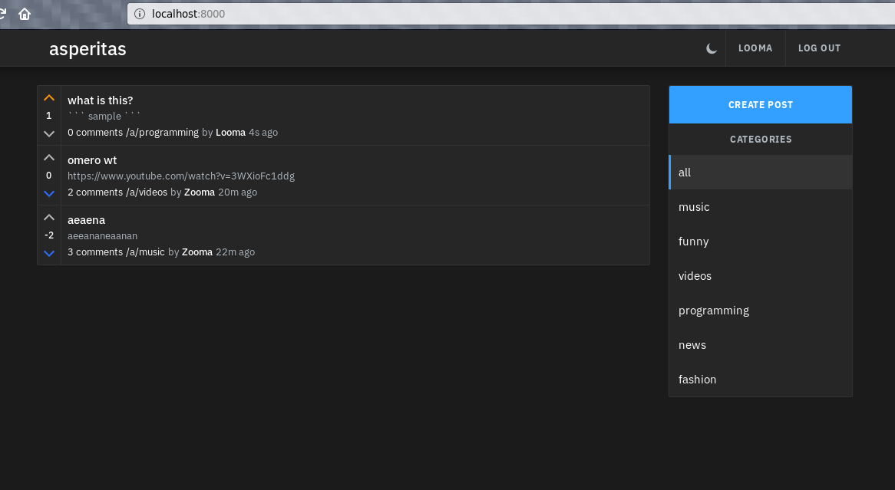

# reddit-clone-example

This is example of realization of Reddit-like API with Go
language. Client part is Javascript taken from
https://github.com/d11z/asperitas. Original project realizes backend
in NodeJS and MongoDB. I have used Go and Postgres. This is just an
example of Go code for HTTP handling and working with database.

The code was developed as a test task for the job interview for one
company. I don't decide I will work there but anyway task was fun :)

This simple web application offers:

* creation of articles
* comments
* signup/signin for users
* voting for articles

## Requirements

* go compiler
* docker
* docker-compose
* make
* git

## Installation

Default installation folder for docker-compose configs and database
volume is `/var/lib/local/reddit-clone-example`. Edit installation
script if you want another location.

1. Clone repo and run `make docker` inside root directory.
2. Run `deployments/install.sh` for the first start. It has dirty
   workaround for applying database migrations after database really
   started. I was lazy to implement it in a right way.
3. Point your browser to http://localhost:8000

Stop and run it then with `docker-compose down` and `docker-compose up
-d` inside the installation directory.

## Notes about realization

Notable libraries that I used for this fast development:

* Webframework https://github.com/gin-gonic/gin
* Wrapper on database/sql https://github.com/jmoiron/sqlx
* Configuration in environment variables https://github.com/kelseyhightower/envconfig
* Working with UUID v4 https://github.com/google/uuid
* JWT parser https://github.com/dgrijalva/jwt-go
* For logging I used my logfmt implementation https://github.com/grafov/kiwi
* The code layout mostly based on https://github.com/golang-standards/project-layout

## License

The code of the backend is public domain. The code of frontend part
belongs to github.com/d11z/asperitas project, check its license if you
want to use it.
